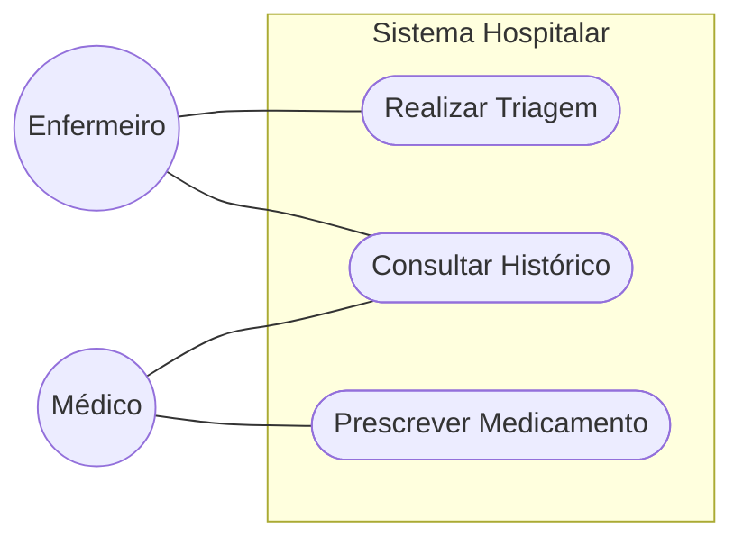

# Modelagem de Casos de Uso

## 1. Diagrama de Casos de Uso
*(Inserir imagem ou Mermaid)*

## 2. Especificação (Exemplo)
### UC001 - Triagem
* **Ator**: Enfermeiro.
* **Fluxo**: Selecionar paciente -> Inserir Sinais Vitais -> Calcular Manchester.
